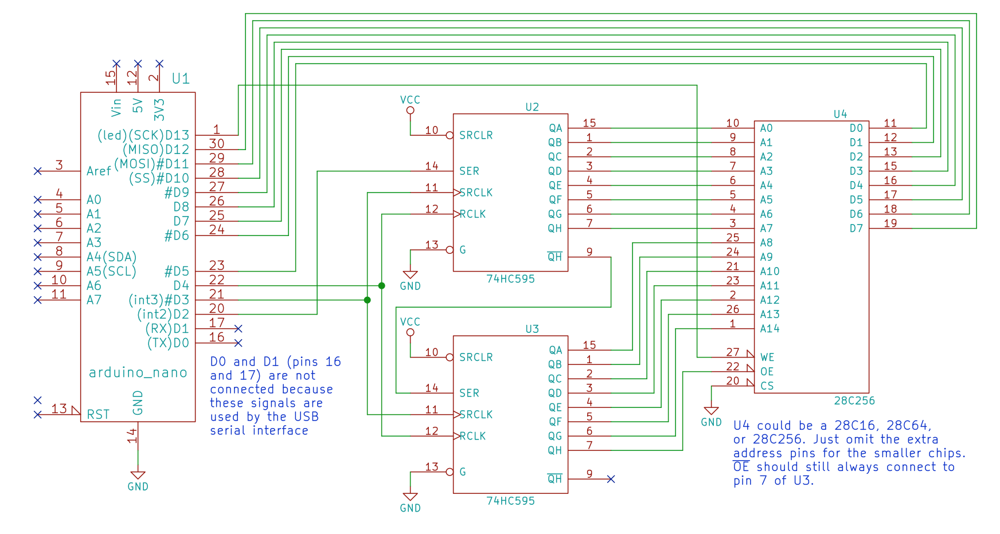

<!-- ===================================================== -->
<!-- HERO -->
<!-- ===================================================== -->

<h1 align="center">
🔌 Arduino EEPROM Programmer
</h1>

<p align="center">
An Arduino-based programmer for 28C Series EEPROMs with support for microcode generation,
display ROM creation, and educational 8-bit computer projects.
</p>

<p align="center">


</p>

---

# 📸 Project Preview

<p align="center">

</p>

---

# 📑 Table of Contents

- [Overview](#-overview)
- [Key Features](#-key-features)
- [Project Goals](#-project-goals)
- [Hardware Components](#-hardware-components)
- [Supported EEPROM Devices](#-supported-eeprom-devices)
- [Project Architecture](#-project-architecture)
- [Why Shift Registers?](#-why-shift-registers)
- [Circuit Diagram](#-circuit-diagram)
- [Repository Structure](#-repository-structure)
- [Arduino Sketches](#-arduino-sketches)
- [Installation](#-installation)
- [Usage](#-usage)
- [Programming Workflow](#-programming-workflow)
- [Applications](#-applications)
- [Troubleshooting](#-troubleshooting)
- [FAQ](#-faq)
- [Future Improvements](#-future-improvements)
- [Credits](#-credits)
- [License](#-license)

---

# 📖 Overview

The **Arduino EEPROM Programmer** is a complete hardware and software solution for programming parallel EEPROM chips such as:

- AT28C16
- AT28C64
- AT28C256

using only an **Arduino Nano** and two **74HC595 shift registers**.

The project was originally inspired by **Ben Eater's 8-bit computer series**, but this repository also contains additional sketches that demonstrate practical EEPROM applications including:

- Binary lookup tables
- Seven-segment display ROMs
- CPU instruction decoder ROMs
- Extended microcode with flags
- Memory dumping
- EEPROM verification

This repository is intended for anyone interested in:

- Embedded Systems
- Computer Architecture
- Digital Electronics
- Arduino Development
- EEPROM Programming

---

# ✨ Key Features

## EEPROM Programming

- Read EEPROM
- Write EEPROM
- Verify EEPROM
- Dump Memory
- Address Verification

---

## Display Decoder Generation

Generate lookup tables for:

- 7-Segment Displays
- Decimal Decoder ROMs
- Binary-to-Display conversion

---

## CPU Microcode Programming

Generate EEPROMs containing:

- Fetch Cycle
- Execute Cycle
- Control Words
- Instruction Decoder
- Conditional Instructions

---

## Educational Focus

Perfect for learning:

- Parallel Memories
- Digital Logic
- Shift Registers
- Address Buses
- Data Buses
- Computer Architecture
- Breadboard Computers

---

# 🎯 Project Goals

This project was created to demonstrate how inexpensive hardware can be used to build a reliable EEPROM programmer.

Main objectives include:

✅ Learning EEPROM programming

✅ Understanding parallel memory devices

✅ Building an inexpensive programmer

✅ Learning Arduino GPIO control

✅ Understanding CPU microcode

✅ Building ROM lookup tables

✅ Supporting educational computer projects

---

# 🛠 Hardware Components

| Component | Quantity |
|-----------|---------:|
| Arduino Nano / Uno | 1 |
| 74HC595 Shift Registers | 2 |
| AT28C16 / 28C64 / 28C256 | 1 |
| Breadboard | 1 |
| Jumper Wires | Several |
| USB Cable | 1 |
| 5V Power Supply | 1 |

---

# 💾 Supported EEPROM Devices

| Device | Capacity | Address Lines |
|---------|---------:|--------------:|
| AT28C16 | 2 KB | 11 |
| AT28C64 | 8 KB | 13 |
| AT28C256 | 32 KB | 15 |

Other compatible parallel EEPROM chips can also be programmed after minor modifications.

---

# 🏗 Project Architecture

```text
                 Arduino Nano
                       │
                       │
        ┌──────────────┴──────────────┐
        │                             │
        ▼                             ▼
   74HC595 #1                    74HC595 #2
        │                             │
        └──────────────┬──────────────┘
                       │
               EEPROM Address Bus
                       │
                28C Series EEPROM
                       │
                 Data Bus (8-bit)
                       │
               Read / Write Control
```

---

# 🧩 Why Shift Registers?

Programming a parallel EEPROM requires controlling:

- Address Lines
- Data Bus
- Output Enable
- Write Enable
- Chip Enable

An Arduino Nano simply doesn't have enough digital I/O pins for all these signals.

To solve this problem, this project uses **two 74HC595 Serial-In Parallel-Out Shift Registers**.

Benefits include:

- Fewer Arduino pins required
- Simpler wiring
- Easy scalability
- Low hardware cost
- Reliable address control
- Clean hardware design

Instead of driving every address line directly, the Arduino serially shifts the address into the shift registers, which then hold the address stable while the EEPROM is programmed.

---

# 🔌 Circuit Diagram

The complete wiring schematic is included in this repository.

<p align="center">

</p>

The schematic shows:

- Arduino Nano
- EEPROM
- 74HC595 Shift Registers
- Address Bus
- Data Bus
- Control Signals
- Power Connections

---
# 📂 Repository Structure

```text
Arduino-EEPROM-Programmer/
│
├── 📄 README.md
├── 📷 schematic.png
│
├── 📁 eeprom-programmer/
│   └── eeprom-programmer.ino
│
├── 📁 multiplexed-display/
│   └── multiplexed-display.ino
│
├── 📁 microcode-eeprom-programmer/
│   └── microcode-eeprom-programmer.ino
│
└── 📁 microcode-eeprom-with-flags/
    └── microcode-eeprom-with-flags.ino
```

The repository is divided into multiple Arduino sketches, each demonstrating a different application of EEPROM programming.

Although the code shares many common routines, every sketch focuses on a different educational objective.

---

# 📄 Arduino Sketches

This repository contains **four independent Arduino sketches**.

Each sketch builds upon the previous one while introducing new concepts.

---

# ① Basic EEPROM Programmer

```text
eeprom-programmer.ino
```

The first sketch demonstrates the core functionality of the EEPROM programmer.

It allows the Arduino to communicate directly with a parallel EEPROM, making it possible to write, read, and verify memory contents.

### Features

- Write bytes into EEPROM
- Read memory contents
- Verify written data
- Dump EEPROM contents to Serial Monitor
- Control the address bus
- Control the data bus
- Generate write pulses

### Learning Objectives

Using this sketch you'll learn:

- Parallel memory communication
- EEPROM write timing
- Address selection
- Data verification
- Read/Write cycles

---

# ② Multiplexed Display EEPROM

```text
multiplexed-display.ino
```

Instead of using software to calculate the segments that must be illuminated, this sketch generates a ROM lookup table.

Each EEPROM address corresponds to a binary number, while each EEPROM output represents the segment pattern required to display that number.

This dramatically simplifies digital circuit design.

### Features

- Decimal lookup table generation
- Binary to seven-segment conversion
- Fast hardware decoding
- Multiplexed display support

### Typical Applications

- Digital clocks
- Binary counters
- Frequency counters
- Embedded displays
- Breadboard computers

---

# ③ CPU Microcode EEPROM

```text
microcode-eeprom-programmer.ino
```

One of the most interesting sketches in this repository.

Instead of implementing a CPU instruction decoder using dozens of logic chips, the control signals are stored inside an EEPROM.

Each instruction simply points to a microcode address.

The EEPROM returns the control signals required for that CPU cycle.

### Generates

- Fetch cycle
- Decode cycle
- Execute cycle
- Instruction control words

### Advantages

- Easy debugging
- Easier CPU expansion
- Simpler hardware
- New instructions can be added without rewiring the CPU

---

# ④ CPU Microcode with Flags

```text
microcode-eeprom-with-flags.ino
```

This sketch extends the previous microcode generator by adding CPU flag support.

Instead of executing every instruction identically, the generated microcode can now react to processor flags.

Supported flags include:

- Zero Flag (Z)
- Carry Flag (C)

This enables conditional instructions such as:

- Jump if Zero
- Jump if Carry
- Conditional Branches

These additions make the CPU significantly more powerful while keeping the hardware simple.

---

# 🚀 Getting Started

## Requirements

Before running the project, make sure you have:

- Arduino IDE 2.x
- Arduino Nano or Uno
- USB Cable
- EEPROM Chip
- Breadboard
- Two 74HC595 Shift Registers
- Jumper Wires
- 5V Power Supply

---

# 📥 Installation

Clone the repository:

```bash
git clone https://github.com/yourusername/Arduino-EEPROM-Programmer.git
```

Open the project using the Arduino IDE.

Select the sketch that matches your desired application.

For beginners, it is highly recommended to start with:

```text
eeprom-programmer.ino
```

---

# ⚙ Arduino IDE Configuration

Board:

```text
Arduino Nano
```

Processor:

```text
ATmega328P
```

Programmer:

```text
AVRISP mkII
```

Upload Speed:

```text
115200
```

---

# ▶ Uploading the Sketch

1. Connect the Arduino via USB.
2. Open the Arduino IDE.
3. Select the correct board.
4. Select the correct COM port.
5. Open the desired sketch.
6. Click **Upload**.

After uploading, the Arduino immediately becomes an EEPROM programmer.

---

# 💻 Using the Programmer

After assembling the hardware according to the schematic:

1. Insert the EEPROM into the programmer.
2. Power the circuit.
3. Upload the desired sketch.
4. Open the Serial Monitor (if required).
5. Program or read the EEPROM.

The programmer automatically controls:

- Address Lines
- Data Bus
- Write Enable
- Output Enable

while handling all timing requirements internally.

---

# 🔄 Programming Workflow

```text
          Start
            │
            ▼
   Initialize Arduino
            │
            ▼
 Shift Address into 74HC595
            │
            ▼
 Output Address to EEPROM
            │
            ▼
 Put Data on Data Bus
            │
            ▼
 Pulse Write Enable
            │
            ▼
 Wait for EEPROM Write
            │
            ▼
 Verify Data
            │
            ▼
 Next Address
            │
            ▼
          Finish
```

---

# 🖥 Example Serial Output

```text
Writing EEPROM...

Address 0000 : FF

Address 0001 : 42

Address 0002 : 13

Verification Successful.

EEPROM Programming Complete.
```

---

# 🎮 Applications

The EEPROMs programmed using this project can be used for:

- 8-bit Breadboard Computers
- ROM Lookup Tables
- Seven-Segment Display Drivers
- Instruction Decoders
- Embedded Systems
- Educational Electronics Projects
- Custom Digital Logic
# 📈 Performance

The programmer is designed to provide reliable EEPROM programming while maintaining a simple hardware design and a low component count.

## Advantages

- ✅ Reliable EEPROM programming
- ✅ Low-cost hardware
- ✅ Easy to assemble
- ✅ Beginner friendly
- ✅ Expandable design
- ✅ Open-source
- ✅ Educational

---

# ⚡ Performance Overview

| Feature | Status |
|----------|:------:|
| EEPROM Read | ✅ |
| EEPROM Write | ✅ |
| Memory Verification | ✅ |
| Memory Dump | ✅ |
| 7-Segment ROM Generation | ✅ |
| CPU Microcode Generation | ✅ |
| Conditional Microcode | ✅ |
| Arduino Nano Compatible | ✅ |
| Arduino Uno Compatible | ✅ |

---

# 🔍 Troubleshooting

## Arduino cannot detect the EEPROM

### Possible Causes

- Incorrect wiring
- Missing 5V supply
- Loose jumper wires
- EEPROM inserted backwards

### Solution

- Verify the schematic carefully.
- Check power and ground connections.
- Ensure the EEPROM notch orientation is correct.
- Measure the 5V rail using a multimeter.

---

## EEPROM Programming Fails

### Possible Causes

- Faulty EEPROM
- Incorrect write timing
- Bad breadboard connection

### Solution

- Test with another EEPROM.
- Verify the Write Enable pulse.
- Re-seat the EEPROM.

---

## Incorrect Data After Programming

### Possible Causes

- Floating data bus
- Wrong address lines
- Shift register wiring issue

### Solution

- Verify all address connections.
- Check 74HC595 outputs.
- Compare the dump with expected data.

---

## Shift Registers Not Working

Verify the following pins:

- Data
- Clock
- Latch
- Output Enable
- VCC
- GND

A single disconnected wire may prevent addresses from updating correctly.

---

# ❓ Frequently Asked Questions

## Why are two 74HC595 chips used?

The Arduino Nano doesn't provide enough GPIO pins to directly control every EEPROM address line.

Using two 74HC595 shift registers expands the available outputs while requiring only a few Arduino pins.

---

## Which EEPROM chips are supported?

The programmer currently supports:

- AT28C16
- AT28C64
- AT28C256

Other compatible EEPROM devices can also be used after minor software modifications.

---

## Can I use an Arduino Uno?

Yes.

The project works with:

- Arduino Nano
- Arduino Uno

---

## Is this programmer suitable for beginners?

Absolutely.

This repository was designed primarily for learning:

- EEPROM Programming
- Digital Electronics
- Arduino
- Computer Architecture

---

## Do I need external libraries?

No.

Everything is written using standard Arduino functions.

---

# 🚧 Future Improvements

Potential future enhancements include:

- GUI Application
- Automatic EEPROM Detection
- Serial Command Interface
- USB Desktop Utility
- PCB Version
- EEPROM Backup Tool
- Binary File Import
- Intel HEX Support
- Faster Programming Algorithm
- Progress Indicator
- Error Reporting
- Verification Statistics

---

# 🎓 Learning Outcomes

After completing this project you will understand:

- EEPROM Architecture
- Parallel Memory
- Address Buses
- Data Buses
- Shift Registers
- Memory Timing
- Arduino GPIO
- Microcode
- Instruction Decoding
- ROM Lookup Tables
- Computer Architecture Fundamentals

---

# 📚 References

The project is heavily inspired by the outstanding educational work of **Ben Eater**.

Recommended reading:

- AT28C16 Datasheet
- AT28C64 Datasheet
- AT28C256 Datasheet
- 74HC595 Datasheet
- Arduino Documentation

---

# 🎥 Recommended Videos

For a complete understanding of this project, the following videos are highly recommended:

### Build an Arduino EEPROM Programmer

Introduces the hardware and programming process.

---

### Build an 8-Bit Decimal Display

Demonstrates using EEPROM as a lookup table for seven-segment displays.

---

### Reprogramming CPU Microcode

Shows how EEPROM can replace traditional instruction decoding logic.

---

### Adding Machine Language Instructions

Explains extending the CPU instruction set by updating EEPROM microcode.

---

### Conditional Jump Instructions

Introduces conditional branching using CPU flags stored in EEPROM.

---

# 🤝 Contributing

Contributions are always welcome.

Ideas include:

- Supporting additional EEPROM chips
- Code optimization
- PCB design
- Better documentation
- Additional examples
- GUI tools

Feel free to fork the project and submit a Pull Request.

---

# ⭐ Show Your Support

If you found this project useful:

- ⭐ Star the repository
- 🍴 Fork the repository
- 🛠 Improve the code
- 📝 Report issues
- 📢 Share the project

Every contribution helps the open-source community.

---
# 👨‍💻 Author

<p align="center">


</p>

## Mazen Mahmoud

**Management Information Systems Student**

Passionate about:

- Embedded Systems
- Computer Architecture
- Arduino Development
- Networking
- Python Development
- Artificial Intelligence

---

# 🌐 Connect With Me

<p align="center">

<a href="https://github.com/Mazen-Mahmoud-Mohamed">

</a>

<a href="https://www.linkedin.com/in/mazen-mahmoud-529120394/">

</a>

<a href="mailto:mazenmahmod397@gmail.com">

</a>

</p>

---

# 📊 Repository Statistics

### Project Highlights

| Category | Details |
|----------|---------|
| Language | C++ |
| Platform | Arduino Nano / Uno |
| EEPROM Support | 28C16, 28C64, 28C256 |
| Shift Registers | 2 × 74HC595 |
| License | MIT |
| Difficulty | Intermediate |

---

# 🛣 Roadmap

Future versions may include:

- [ ] GUI Programmer (Windows)
- [ ] Intel HEX File Support
- [ ] Binary File Programming
- [ ] Automatic EEPROM Detection
- [ ] Progress Bar
- [ ] Faster Programming Algorithm
- [ ] PCB Version
- [ ] EEPROM Backup Utility
- [ ] Serial Command Interface
- [ ] Cross-Platform Desktop App

---

# 📜 License

This repository is released under the **MIT License**.

The original project and educational concepts were created by **Ben Eater**.

This repository preserves the educational spirit of the original work while providing a well-documented implementation for learning and experimentation.

---

# 🙏 Acknowledgements

Special thanks to:

- **Ben Eater** for his incredible educational content.
- The Arduino Community.
- Open Source Contributors.
- Everyone passionate about digital electronics and computer architecture.

---

# ⭐ Support the Project

If you found this project useful, please consider:

- ⭐ Starring the repository
- 🍴 Forking the project
- 📝 Opening issues
- 🔧 Contributing improvements
- 📢 Sharing it with others

Every contribution helps make educational open-source projects even better.

---

# 📚 Related Topics

- Arduino
- EEPROM Programming
- 74HC595
- Digital Electronics
- Computer Architecture
- Breadboard Computers
- Microcode
- ROM Programming
- Embedded Systems
- Parallel Memory

---

# 📈 Repository Activity

This repository serves as an educational reference for:

- Students
- Makers
- Embedded Developers
- Electronics Enthusiasts
- Computer Architecture Learners

---

<p align="center">

## ⭐ Thanks for Visiting!

If you enjoyed this project, don't forget to leave a ⭐ on the repository.

Made with ❤️ using **Arduino**, **C++**, and **Digital Logic**.

</p>
